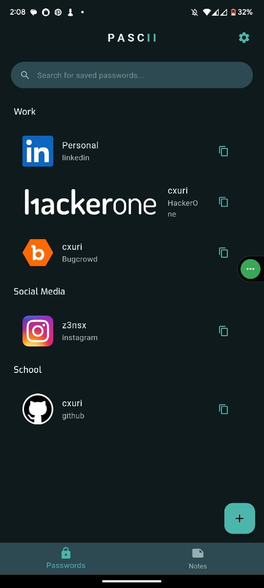

# 🔒 Pascii — Offline-First Password Manager

**Pascii** is a secure, open-source password manager built with Flutter.  
It features **biometric authentication**, **AES-256 encryption**, and **100% offline storage** — putting your privacy and security first.

<p align="center">
  
</p>


<p align="center">
  <a href="https://github.com/cxuri/pascii/stargazers">
    
  </a>
  <a href="https://github.com/cxuri/pascii/blob/main/LICENSE">
    
  </a>
  <a href="https://github.com/cxuri/pascii/releases">
    
  </a>
  <a href="https://flutter.dev">
    
  </a>
</p>

---

## ✨ Features
| Security               | Convenience        | Extras               |
|------------------------|--------------------|----------------------|
| 🔐 AES-256 Encryption  | 📱 Biometric Auth   | 🎨 Custom Themes     |
| 🚫 100% Offline        | 🔄 One-Tap Copy     | 📊 Strength Analyzer |
| 🔑 Secure Key Storage  | 📝 Rich Notes       |                      |

---

## 📸 See Pascii in Action

### 🔑 Password Management
| Home Screen | Create Password | View Password |
|-------------|-----------------|---------------|
|  |  |  |

### ⚙️ Advanced Features
| Password Generator | Quick Actions |
|--------------------|---------------|
|  |  |

---

## 🚀 Getting Started

### Prerequisites
- Flutter SDK (3.19.0 or later)
- Android Studio/Xcode for development
- Java JDK 17+ (for Android builds)

### Development Setup
```bash
# 1. Clone the repository
git clone https://github.com/cxuri/pascii.git
cd pascii

# 2. Initialize Flutter project
flutter create .

# 3. Install dependencies
flutter pub get

# 4. Run the app
flutter run
```

### 🏗️ Building for Release (Android)
#### Step 1: Generate Keystore
```bash
keytool -genkey -v -keystore ~/upload-keystore.jks -keyalg RSA -keysize 2048 -validity 10000 -alias upload
```

### Store this file securely! You'll need it for all future updates.
#### Step 2: Create keystore.properties

```properties
storePassword=your_store_password
keyPassword=your_key_password
keyAlias=upload
storeFile=../upload-keystore.jks
```
### Step 3: Build Release APK
```bash
flutter build apk --release
# or for app bundle:
flutter build appbundle
```
### Step 4: Locate Outputs
APK: build/app/outputs/flutter-apk/app-release.apk
app Bundle: build/app/outputs/bundle/release/app-release.aab

## 🤝 Contributing

We welcome all contributions! Here's how:

1. Fork the repository  
2. Create your feature branch:  
   ```bash
   git checkout -b feature/amazing-feature
   ```
3. Commit your changes:  
   ```bash
   git commit -m 'Add some amazing feature'
   ```
4. Push to the branch:  
   ```bash
   git push origin feature/amazing-feature
   ```
5. Open a Pull Request

### Before submitting:
```bash
flutter analyze
flutter test
flutter format .
```

---

## 📜 License

Distributed under the MIT License. See `LICENSE` for more information.

---

## 🌟 Support the Project

Love Pascii? Here's how you can help:

- ⭐ Star the repository  
- 🐛 Report bugs or suggest features  
- 📣 Share with your network  
- ☕ Buy me a coffee

Built with ❤️ by [@cxuri](https://github.com/cxuri) · Privacy by design

